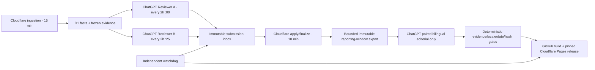

# Autonomous operation incident — 2026-10-06

Status: recovery in progress; 24-hour unattended acceptance has **not** passed.
No Daily publication is implied by this document. PR #3 remains Draft and unmerged.

## Evidence and repair

- Scheduled A/B and Daily executions encountered `User input required but current turn is running in a non-interactive mode.` The old prompts allowed STOP to become recurring-task disablement. This is the observed failure; a separate platform auto-pause mechanism has not been established.
- OAuth provider 1.2.1 previously used a fixed 86,400-second refresh grant lifetime. Refreshing access tokens did not extend that lifetime. `AUTH_POLICY` now keeps one-hour access tokens and a 24-hour rotating **idle** refresh lease. Scope narrowing and grant revocation still apply. Expired/revoked grants require interactive reauthorization; the change cannot resurrect them.
- Worker deployment: `2034b38d-ab70-4231-8964-88ae19a7e562`. A and B were separately signed in with the existing Owner credential. No new Owner secret or broader reviewer scope was created. Both role reads succeeded. A has new production submissions through 2026-10-06 09:00:24 UTC; B still required successful submission validation when this report was written.
- Five-article evidence responses can be truncated in the ChatGPT task environment. Role prompts now request one article at a time, up to 20 sequential articles per execution, stopping on an unresolved error or execution limit. No evidence text/hash is changed to reduce output. The ceiling is 240 articles/day per role at a two-hour cadence; this is a ceiling, not measured throughput.
- Single-execution failures must not disable/pause/delete the recurring task. Safety/authentication failures still stop that execution and must be surfaced.
- ChatGPT does not always expose its chat ID to the model. A context claim must be labeled as declared execution metadata, never represented as a platform-attested chat identity. Separate actual A/B task/chat records and D1 receipts remain necessary for independence acceptance.
- The task editor rewrites some custom schedules when saving prompts. A/B are enabled and set to a two-hour frequency. B's required `:25` offset still needs verification/restoration; prompt text alone is not scheduling evidence.

## Remaining production blockers

1. No completed article in the 2026-10-06 Shanghai calendar window was present at the last database check. Low volume is allowed; zero/stale finalized evidence is not a publishable Daily.
2. Reviewer B must complete a real submit/apply/finalize cycle after login. Read success alone does not prove writing or unattended operation.
3. Existing Phase3 exports/verification target historical samples and session-authored bilingual prose. There is no deployed deterministic Daily export/build/deploy schedule or unattended bilingual editorial producer. Do not relabel old samples or claim this repair implements that path.
4. Existing GitHub release-source collection has 403 failures; source health must recover or affected-source coverage must be disclosed. No prerelease filtering was weakened by switching feeds.
5. No deployed alert/watchdog that independently detects disabled cloud tasks, stale role submissions or missing publications has been verified.

## Acceptance and recovery runbook

Check production role reads, then actual independent scheduled-run records, own immutable submission receipts and deterministic application records. Observe at least 24 hours spanning the old grant-expiry boundary. Verify both tasks stay enabled, grants refresh, finalized evidence remains fresh, backlog does not grow without bound, and the morning publication succeeds with accessible paired URLs. A local simulated-clock integration test covers the OAuth library behavior but is not this operational observation.

On authentication failure, stop the affected execution, surface the error and sign in to that same role using the existing Owner credential. Never widen scopes or replace A/B with one shared judging context. A disabled task must be explicitly resumed after remediation; access renewal cannot resume it. On evidence truncation, request smaller complete role batches; do not fill gaps. On uncertain submissions, reuse exact immutable receipts. On publish failure, retain the previous release pin and retry the same date/hash; never silently deploy another date or an incomplete locale pair.

## Target architecture — not deployed by this incident repair

Daily target 08:40 Asia/Shanghai; publishing at 08:45–08:50 is preferable only if measured B/finalize/editorial latency requires it. Weekly target Sunday 08:45; Insight Sunday 17:00 with publication gate. These are targets, not verified new schedules. The morning reporting window needs an explicit policy decision: current `buildDaily()` uses same-calendar-day boundaries, which leaves only the first morning hours at 08:40. Any prior-day/rolling-window policy must be recorded explicitly and applied identically to both locales.
